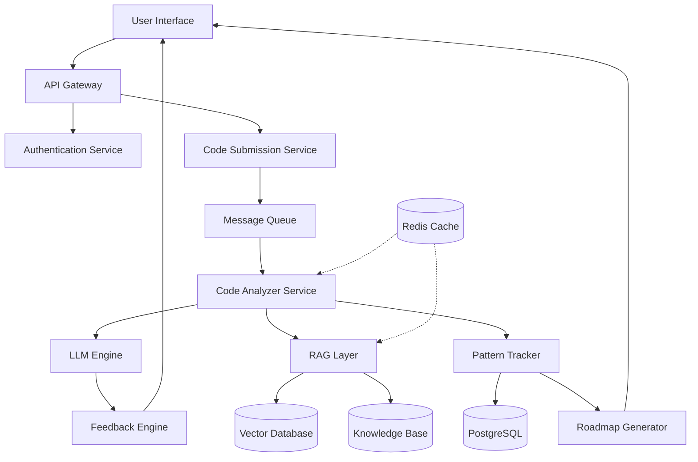

# Design Document: Code Mentor Assistant

## Overview

The Code Mentor Assistant is an AI-powered learning platform that helps early-career developers improve their coding skills through intelligent code analysis, personalized feedback, and adaptive learning roadmaps. The system combines Large Language Models (LLMs) with Retrieval-Augmented Generation (RAG) to provide accurate, grounded feedback based on established programming best practices.

### Key Design Principles

1. **Accuracy through RAG**: Ground all LLM responses in retrieved best practices to minimize hallucinations
2. **Scalability**: Design for horizontal scaling to support growing user base
3. **Language Agnostic**: Abstract language-specific logic to support multiple programming languages
4. **Privacy First**: Encrypt data in transit and at rest, implement strict access controls
5. **Progressive Learning**: Track patterns over time and adapt recommendations to user progress

### Technology Stack Considerations

- **LLM Provider**: OpenAI GPT-4, Anthropic Claude, or open-source alternatives (Llama 2, Mistral)
- **Vector Database**: Pinecone, Weaviate, or Qdrant for RAG retrieval
- **Backend**: Python with FastAPI for API services
- **Database**: PostgreSQL for structured data, Redis for caching
- **Message Queue**: RabbitMQ or AWS SQS for async processing
- **Deployment**: Containerized with Docker, orchestrated with Kubernetes

## Architecture

### High-Level Architecture



### Service Architecture

The system follows a microservices architecture with the following key services:

1. **API Gateway**: Entry point for all client requests, handles routing and rate limiting
2. **Authentication Service**: Manages user authentication, authorization, and session management
3. **Code Submission Service**: Receives and validates code submissions, enqueues for processing
4. **Code Analyzer Service**: Orchestrates code analysis using LLM and RAG components
5. **Pattern Tracker Service**: Tracks recurring mistakes and maintains user progress data
6. **Roadmap Generator Service**: Creates personalized learning plans based on tracked patterns
7. **Knowledge Base Service**: Manages the repository of best practices and learning resources

### Data Flow

1. User submits code through UI
2. API Gateway authenticates request and forwards to Code Submission Service
3. Code Submission Service validates input and enqueues message
4. Code Analyzer Service picks up message from queue
5. RAG Layer retrieves relevant context from Knowledge Base
6. LLM Engine analyzes code with retrieved context
7. Feedback Engine formats response with explanations and examples
8. Pattern Tracker updates user's mistake history
9. Response returned to user through API Gateway

## Components and Interfaces

### 1. API Gateway

**Responsibilities:**
- Route incoming requests to appropriate services
- Implement rate limiting (100 requests per user per hour)
- Handle CORS and security headers
- Aggregate responses from multiple services

**Interface:**
```python
class APIGateway:
    def route_request(request: HTTPRequest) -> HTTPResponse
    def apply_rate_limit(user_id: str) -> bool
    def authenticate_request(request: HTTPRequest) -> AuthToken
```

### 2. Code Submission Service

**Responsibilities:**
- Validate code submissions (non-empty, size limits)
- Detect programming language
- Enqueue submissions for async processing
- Return submission ID for tracking

**Interface:**
```python
class CodeSubmissionService:
    def submit_code(
        user_id: str,
        code: str,
        language: Optional[str],
        options: SubmissionOptions
    ) -> SubmissionID
    
    def validate_submission(code: str) -> ValidationResult
    def detect_language(code: str) -> ProgrammingLanguage
```

**Data Structures:**
```python
class SubmissionOptions:
    language_preference: str  # "en", "hi", "ta", "te"
    simplified_english: bool
    include_examples: bool

class ValidationResult:
    is_valid: bool
    error_message: Optional[str]
    detected_language: Optional[str]
```

### 3. Code Analyzer Service

**Responsibilities:**
- Orchestrate code analysis workflow
- Identify coding mistakes and quality issues
- Coordinate between LLM Engine and RAG Layer
- Categorize issues by severity and type

**Interface:**
```python
class CodeAnalyzerService:
    def analyze_code(
        submission: CodeSubmission
    ) -> AnalysisResult
    
    def identify_mistakes(code: str, language: str) -> List[CodingMistake]
    def identify_quality_issues(code: str, language: str) -> List[QualityIssue]
    def categorize_issues(issues: List[Issue]) -> CategorizedIssues
```

**Data Structures:**
```python
class CodeSubmission:
    submission_id: str
    user_id: str
    code: str
    language: str
    timestamp: datetime
    options: SubmissionOptions

class CodingMistake:
    mistake_id: str
    line_number: int
    mistake_type: str  # "syntax", "logic", "runtime"
    severity: str  # "critical", "major", "minor"
    description: str
    category: str  # "loops", "conditionals", "data_structures", etc.

class QualityIssue:
    issue_id: str
    line_number: int
    issue_type: str  # "readability", "maintainability", "performance"
    severity: str
    description: str
    impact: str

class AnalysisResult:
    submission_id: str
    mistakes: List[CodingMistake]
    quality_issues: List[QualityIssue]
    overall_score: float
    processing_time: float
```

### 4. LLM Engine

**Responsibilities:**
- Process code to understand structure, logic, and intent
- Generate context-aware explanations
- Handle syntax errors gracefully
- Produce corrected code examples

**Interface:**
```python
class LLMEngine:
    def understand_code(
        code: str,
        language: str,
        context: RAGContext
    ) -> CodeUnderstanding
    
    def generate_explanation(
        mistake: CodingMistake,
        context: RAGContext,
        language_preference: str
    ) -> Explanation
    
    def generate_corrected_example(
        code: str,
        mistake: CodingMistake
    ) -> str
    
    def detect_language(code: str) -> str
```

**Data Structures:**
```python
class CodeUnderstanding:
    structure: Dict[str, Any]  # AST-like representation
    intent: str  # What the code is trying to do
    identified_patterns: List[str]
    potential_issues: List[str]

class Explanation:
    what: str  # What the mistake is
    why: str  # Why it's incorrect
    how_to_fix: str  # How to correct it
    corrected_example: str
    confidence: float  # 0.0 to 1.0
```

### 5. RAG Layer

**Responsibilities:**
- Retrieve relevant best practices from Knowledge Base
- Retrieve clean code principles
- Retrieve interview expectations
- Provide context to ground LLM responses
- Indicate confidence level of retrieved context

**Interface:**
```python
class RAGLayer:
    def retrieve_context(
        query: str,
        language: str,
        top_k: int = 5
    ) -> RAGContext
    
    def retrieve_best_practices(
        concept: str,
        language: str
    ) -> List[BestPractice]
    
    def retrieve_clean_code_principles(
        issue_type: str
    ) -> List[CleanCodePrinciple]
    
    def retrieve_interview_expectations(
        concept: str
    ) -> List[InterviewExpectation]
```

**Data Structures:**
```python
class RAGContext:
    best_practices: List[BestPractice]
    clean_code_principles: List[CleanCodePrinciple]
    interview_expectations: List[InterviewExpectation]
    confidence: float  # Average confidence of retrieved items
    sources: List[str]  # References to source documents

class BestPractice:
    practice_id: str
    title: str
    description: str
    language: str
    concept: str
    example_code: str
    relevance_score: float

class CleanCodePrinciple:
    principle_id: str
    title: str
    description: str
    examples: List[str]
    anti_patterns: List[str]
    relevance_score: float

class InterviewExpectation:
    expectation_id: str
    concept: str
    description: str
    importance_level: str  # "essential", "important", "nice-to-have"
    relevance_score: float
```

### 6. Feedback Engine

**Responsibilities:**
- Format explanations in beginner-friendly language
- Generate feedback in requested language (English, Hindi, Tamil, Telugu)
- Provide corrected code examples
- Prioritize critical issues over minor ones
- Validate feedback quality

**Interface:**
```python
class FeedbackEngine:
    def generate_feedback(
        analysis: AnalysisResult,
        explanations: List[Explanation],
        options: SubmissionOptions
    ) -> Feedback
    
    def format_explanation(
        explanation: Explanation,
        language: str,
        simplified: bool
    ) -> str
    
    def prioritize_issues(
        mistakes: List[CodingMistake],
        quality_issues: List[QualityIssue]
    ) -> List[Issue]
    
    def validate_feedback(feedback: Feedback) -> ValidationResult
```

**Data Structures:**
```python
class Feedback:
    submission_id: str
    prioritized_issues: List[FormattedIssue]
    overall_assessment: str
    next_steps: List[str]
    confidence: float
    language: str

class FormattedIssue:
    issue: Union[CodingMistake, QualityIssue]
    explanation: str
    corrected_example: Optional[str]
    learning_resources: List[str]
    priority: int
```

### 7. Pattern Tracker Service

**Responsibilities:**
- Track recurring mistakes across submissions
- Categorize mistakes by concept area
- Calculate mistake frequencies
- Identify resolved patterns
- Maintain user progress history

**Interface:**
```python
class PatternTrackerService:
    def track_submission(
        user_id: str,
        analysis: AnalysisResult
    ) -> None
    
    def identify_patterns(
        user_id: str,
        min_occurrences: int = 2
    ) -> List[MistakePattern]
    
    def get_user_history(
        user_id: str,
        limit: int = 50
    ) -> List[SubmissionHistory]
    
    def mark_pattern_resolved(
        user_id: str,
        pattern_id: str
    ) -> None
```

**Data Structures:**
```python
class MistakePattern:
    pattern_id: str
    user_id: str
    mistake_type: str
    category: str  # "loops", "conditionals", etc.
    frequency: int
    first_occurrence: datetime
    last_occurrence: datetime
    is_resolved: bool
    resolution_date: Optional[datetime]

class SubmissionHistory:
    submission_id: str
    timestamp: datetime
    language: str
    mistake_count: int
    quality_issue_count: int
    overall_score: float
```

### 8. Roadmap Generator Service

**Responsibilities:**
- Generate personalized learning roadmaps
- Prioritize concepts by mistake frequency
- Include learning resources and practice exercises
- Update roadmaps based on progress
- Organize goals in logical progression

**Interface:**
```python
class RoadmapGeneratorService:
    def generate_roadmap(
        user_id: str,
        patterns: List[MistakePattern]
    ) -> LearningRoadmap
    
    def prioritize_concepts(
        patterns: List[MistakePattern]
    ) -> List[ConceptPriority]
    
    def find_learning_resources(
        concept: str,
        language: str
    ) -> List[LearningResource]
    
    def update_roadmap(
        user_id: str,
        progress: UserProgress
    ) -> LearningRoadmap
```

**Data Structures:**
```python
class LearningRoadmap:
    roadmap_id: str
    user_id: str
    created_at: datetime
    updated_at: datetime
    learning_goals: List[LearningGoal]
    estimated_completion_weeks: int

class LearningGoal:
    goal_id: str
    concept: str
    category: str
    priority: int  # 1 = highest
    current_proficiency: float  # 0.0 to 1.0
    target_proficiency: float
    learning_resources: List[LearningResource]
    practice_exercises: List[PracticeExercise]
    prerequisites: List[str]  # Other goal_ids
    status: str  # "not_started", "in_progress", "completed"

class LearningResource:
    resource_id: str
    title: str
    type: str  # "article", "video", "tutorial", "book"
    url: str
    difficulty: str  # "beginner", "intermediate", "advanced"
    estimated_time_minutes: int
    is_free: bool
    language: str

class PracticeExercise:
    exercise_id: str
    title: str
    description: str
    difficulty: str
    estimated_time_minutes: int
    solution_available: bool
```

### 9. Knowledge Base Service

**Responsibilities:**
- Store and manage programming best practices
- Store clean code principles with examples
- Store interview expectations
- Index content for RAG retrieval
- Support versioning and updates

**Interface:**
```python
class KnowledgeBaseService:
    def add_content(
        content: KnowledgeContent,
        content_type: str
    ) -> str
    
    def update_content(
        content_id: str,
        updated_content: KnowledgeContent
    ) -> None
    
    def delete_content(content_id: str) -> None
    
    def index_for_retrieval(content_id: str) -> None
    
    def get_content_version(
        content_id: str,
        version: int
    ) -> KnowledgeContent
```

**Data Structures:**
```python
class KnowledgeContent:
    content_id: str
    content_type: str  # "best_practice", "clean_code", "interview"
    title: str
    description: str
    language: Optional[str]  # Programming language
    concept: str
    content_body: str
    examples: List[str]
    tags: List[str]
    version: int
    created_at: datetime
    updated_at: datetime
```

## Data Models

### User Model

```python
class User:
    user_id: str
    email: str
    name: str
    created_at: datetime
    last_active: datetime
    preferred_language: str  # "en", "hi", "ta", "te"
    simplified_english: bool
    primary_programming_languages: List[str]
    total_submissions: int
    current_streak_days: int
```

### Submission Model

```python
class Submission:
    submission_id: str
    user_id: str
    code: str
    language: str
    submitted_at: datetime
    processed_at: Optional[datetime]
    status: str  # "pending", "processing", "completed", "failed"
    analysis_result: Optional[AnalysisResult]
    feedback: Optional[Feedback]
```

### Pattern Model

```python
class Pattern:
    pattern_id: str
    user_id: str
    mistake_type: str
    category: str
    frequency: int
    first_seen: datetime
    last_seen: datetime
    is_resolved: bool
    resolution_date: Optional[datetime]
    related_submissions: List[str]  # submission_ids
```

### Roadmap Model

```python
class Roadmap:
    roadmap_id: str
    user_id: str
    created_at: datetime
    updated_at: datetime
    goals: List[LearningGoal]
    completion_percentage: float
    estimated_weeks_remaining: int
```

### Cache Model

```python
class CacheEntry:
    key: str
    value: Any
    ttl_seconds: int
    created_at: datetime
    access_count: int
```

## Database Schema

### PostgreSQL Tables

**users**
- user_id (UUID, PRIMARY KEY)
- email (VARCHAR, UNIQUE)
- name (VARCHAR)
- created_at (TIMESTAMP)
- last_active (TIMESTAMP)
- preferred_language (VARCHAR)
- simplified_english (BOOLEAN)
- primary_programming_languages (TEXT[])
- total_submissions (INTEGER)
- current_streak_days (INTEGER)

**submissions**
- submission_id (UUID, PRIMARY KEY)
- user_id (UUID, FOREIGN KEY)
- code (TEXT)
- language (VARCHAR)
- submitted_at (TIMESTAMP)
- processed_at (TIMESTAMP)
- status (VARCHAR)
- analysis_result (JSONB)
- feedback (JSONB)
- INDEX on (user_id, submitted_at)

**patterns**
- pattern_id (UUID, PRIMARY KEY)
- user_id (UUID, FOREIGN KEY)
- mistake_type (VARCHAR)
- category (VARCHAR)
- frequency (INTEGER)
- first_seen (TIMESTAMP)
- last_seen (TIMESTAMP)
- is_resolved (BOOLEAN)
- resolution_date (TIMESTAMP)
- related_submissions (UUID[])
- INDEX on (user_id, category)
- INDEX on (user_id, is_resolved)

**roadmaps**
- roadmap_id (UUID, PRIMARY KEY)
- user_id (UUID, FOREIGN KEY, UNIQUE)
- created_at (TIMESTAMP)
- updated_at (TIMESTAMP)
- goals (JSONB)
- completion_percentage (FLOAT)
- estimated_weeks_remaining (INTEGER)

**knowledge_content**
- content_id (UUID, PRIMARY KEY)
- content_type (VARCHAR)
- title (VARCHAR)
- description (TEXT)
- language (VARCHAR)
- concept (VARCHAR)
- content_body (TEXT)
- examples (TEXT[])
- tags (TEXT[])
- version (INTEGER)
- created_at (TIMESTAMP)
- updated_at (TIMESTAMP)
- INDEX on (content_type, concept)
- INDEX on (language, concept)

### Vector Database Schema

**embeddings**
- embedding_id (UUID)
- content_id (UUID, references knowledge_content)
- vector (FLOAT[])
- metadata (JSON)
  - content_type
  - language
  - concept
  - tags

### Redis Cache Keys

- `user:{user_id}:rate_limit` - Rate limiting counter
- `submission:{submission_id}:status` - Submission processing status
- `rag:context:{query_hash}` - Cached RAG retrieval results
- `user:{user_id}:patterns` - Cached user patterns
- `kb:content:{content_id}` - Cached knowledge base content


## Error Handling

### Error Categories

1. **Validation Errors**: Invalid input, empty submissions, unsupported languages
2. **Processing Errors**: LLM failures, RAG retrieval failures, timeout errors
3. **System Errors**: Database failures, service unavailability, network errors
4. **Rate Limit Errors**: User exceeds request quota

### Error Handling Strategies

**Validation Errors:**
- Return HTTP 400 with clear error message
- Provide guidance on correct input format
- Log validation failures for monitoring

**Processing Errors:**
- Implement retry logic with exponential backoff (3 attempts)
- Fall back to cached responses when available
- Return HTTP 503 with estimated retry time
- Alert on-call engineer if failure rate exceeds 5%

**LLM Failures:**
- Retry with different prompt formulation
- Fall back to rule-based analysis if LLM unavailable
- Return partial results with confidence indicators
- Queue for manual review if critical

**RAG Retrieval Failures:**
- Return LLM response with low confidence indicator
- Use cached best practices if available
- Log retrieval failures for knowledge base improvement

**System Errors:**
- Implement circuit breaker pattern for external services
- Return graceful degradation responses
- Queue failed requests for retry
- Send alerts to operations team

**Rate Limit Errors:**
- Return HTTP 429 with Retry-After header
- Provide clear message about rate limits
- Offer premium tier for higher limits

### Error Response Format

```python
class ErrorResponse:
    error_code: str
    error_message: str
    details: Optional[Dict[str, Any]]
    retry_after: Optional[int]  # seconds
    support_reference: str  # For user support
```

### Timeout Configuration

- Code submission validation: 5 seconds
- LLM processing: 25 seconds
- RAG retrieval: 3 seconds
- Total analysis pipeline: 30 seconds
- Database queries: 10 seconds

### Logging and Monitoring

**Log Levels:**
- ERROR: System failures, unhandled exceptions
- WARN: Degraded performance, retry attempts, low confidence responses
- INFO: Request processing, user actions, pattern updates
- DEBUG: Detailed processing steps, RAG retrieval details

**Metrics to Monitor:**
- Request rate and latency (p50, p95, p99)
- Error rate by category
- LLM response time and token usage
- RAG retrieval accuracy and latency
- Database query performance
- Cache hit rate
- Queue depth and processing time
- User satisfaction scores

### Graceful Degradation

When components fail, the system should degrade gracefully:

1. **LLM Unavailable**: Use rule-based analysis with pattern matching
2. **RAG Unavailable**: Use LLM without grounding, mark low confidence
3. **Database Unavailable**: Use cached data, queue writes for later
4. **Pattern Tracker Unavailable**: Skip pattern updates, continue with analysis
5. **Roadmap Generator Unavailable**: Return cached roadmap or skip

## Testing Strategy

The Code Mentor Assistant requires comprehensive testing to ensure accuracy, reliability, and scalability. We will employ a dual testing approach combining unit tests for specific scenarios and property-based tests for universal correctness properties.

### Testing Approach

**Unit Testing:**
- Test specific examples and edge cases
- Validate error handling and boundary conditions
- Test integration points between services
- Mock external dependencies (LLM, vector database)
- Focus on concrete scenarios that demonstrate correct behavior

**Property-Based Testing:**
- Verify universal properties across all inputs
- Use randomized input generation to discover edge cases
- Test invariants that should hold for all valid inputs
- Minimum 100 iterations per property test
- Each test references its design document property

**Integration Testing:**
- Test end-to-end workflows
- Validate service communication
- Test with real LLM and vector database
- Verify data consistency across services

**Performance Testing:**
- Load testing with 100+ concurrent users
- Stress testing to find breaking points
- Latency testing for 30-second SLA
- Cache effectiveness testing

### Testing Tools

- **Unit Testing**: pytest (Python), Jest (JavaScript/TypeScript)
- **Property-Based Testing**: Hypothesis (Python), fast-check (JavaScript/TypeScript)
- **Integration Testing**: pytest with testcontainers
- **Load Testing**: Locust or k6
- **Mocking**: unittest.mock, responses library

### Test Data Strategy

**Synthetic Code Samples:**
- Generate code with known mistakes for validation
- Create samples across multiple languages
- Include edge cases (empty code, very large files, syntax errors)

**Knowledge Base Test Data:**
- Curated set of best practices for testing
- Test embeddings with known relevance scores
- Version test data alongside production data

**User Pattern Test Data:**
- Simulate user submission histories
- Create patterns with varying frequencies
- Test roadmap generation with different profiles

### Property-Based Testing Configuration

Each property test will:
- Run minimum 100 iterations with randomized inputs
- Include a comment tag: `# Feature: code-mentor-assistant, Property {N}: {property_text}`
- Reference the specific property from the Correctness Properties section
- Use appropriate generators for code, mistakes, and user data
- Validate invariants that must hold for all inputs

### Test Coverage Goals

- Unit test coverage: >80% for all services
- Property test coverage: All correctness properties implemented
- Integration test coverage: All critical user workflows
- Performance test coverage: All SLA requirements validated

